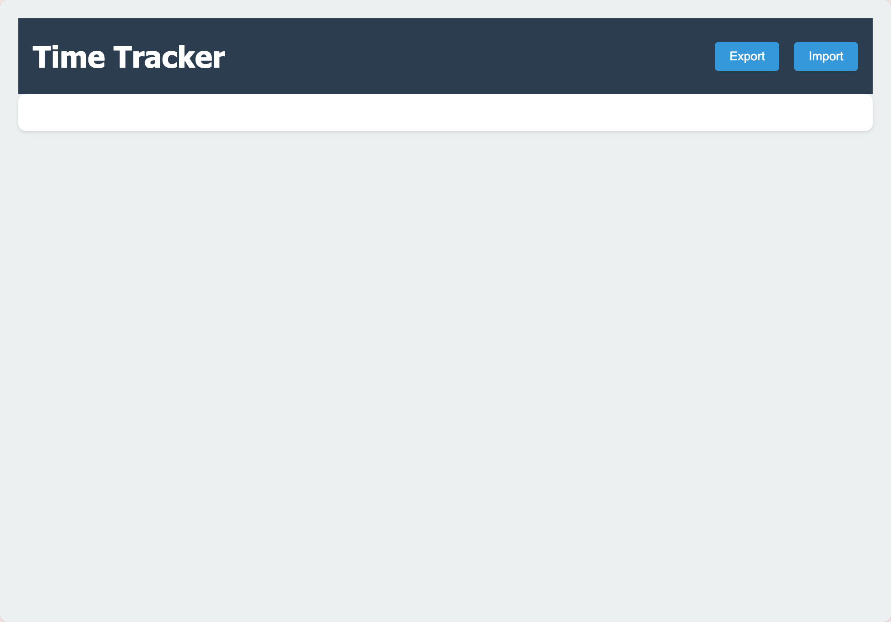
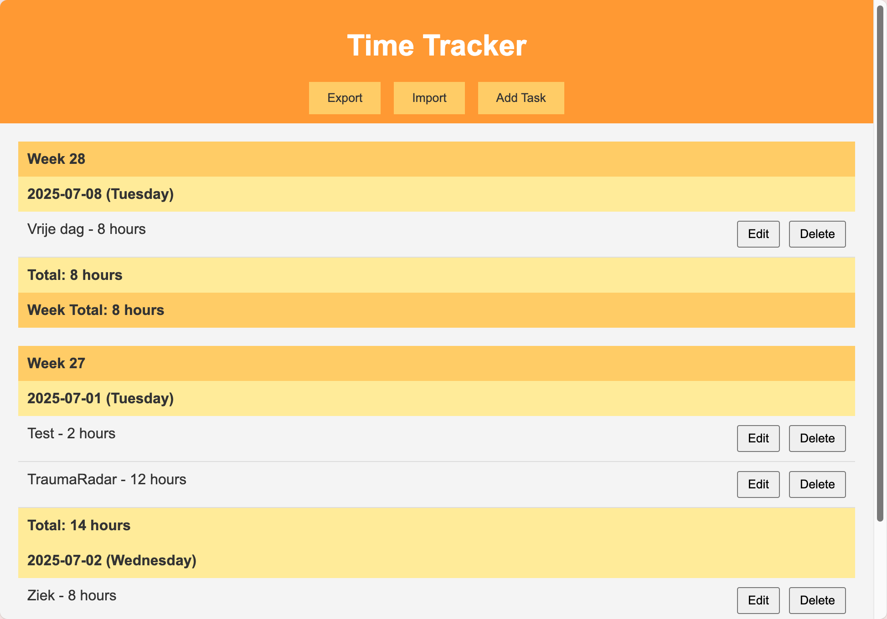
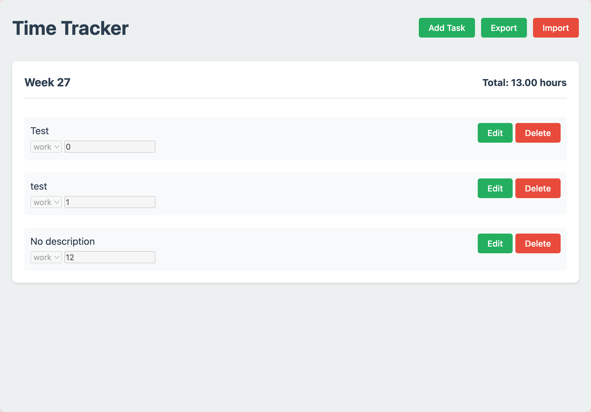
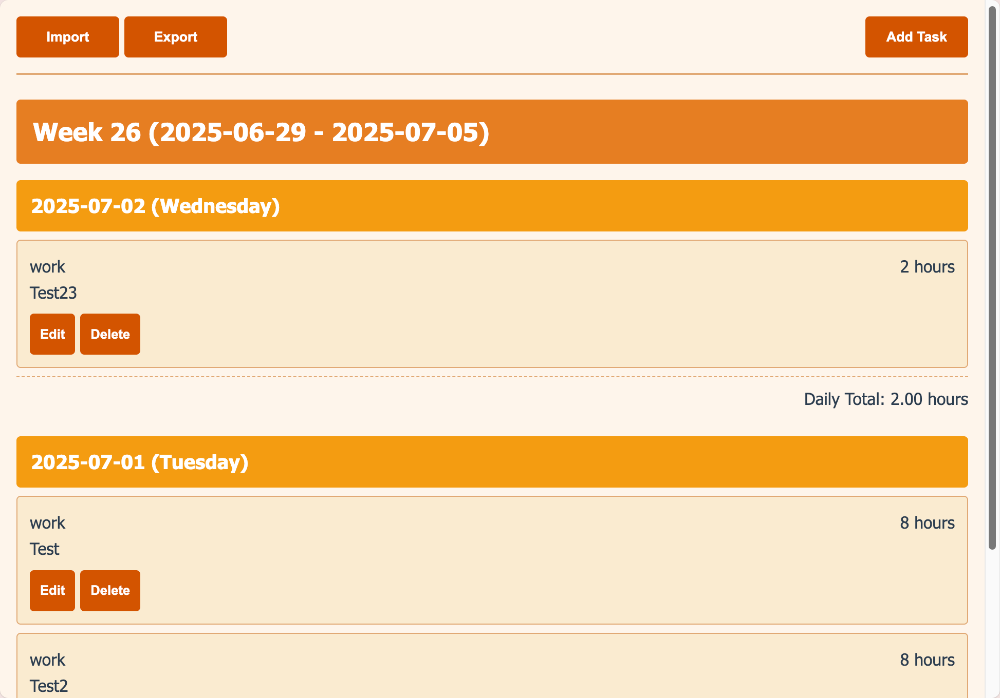

# Time Management Application with multiple language models (14b, 32b, 70b and 671b)

This repository contains the results of a test building a **Time Management Tool** with the FOSS multi-step edit tool [Aider](https://aider.chat/) (something similar to [Windsurf](https://windsurf.com/)). We used 4 different language models through [OpenRouter](https://openrouter.ai/) with Aider. We gave each language model the same initial prompt to build the Time Management Tool. Within this README, we published the findings for each model. We expected the 14b model to give the poorest results. We wanted to know if such a model can be used for programming using multi-step editing or if it does not provide any proper results.

This is not a scientific research study - rather, I tried to find out how results look and feel when running Aider with multiple different models. This project will hopefully give you an idea of what to expect from different model sizes in practice.

## The models:

* Agentica: Deepcoder 14B Preview - https://openrouter.ai/agentica-org/deepcoder-14b-preview:free
* Qwen2.5 Coder 32B Instruct (free) - https://openrouter.ai/qwen/qwen-2.5-coder-32b-instruct:free
* DeepSeek: R1 Distill Llama 70B (free) - https://openrouter.ai/deepseek/deepseek-r1-distill-llama-70b:free
* DeepSeek: R1 0528 (free) - https://openrouter.ai/deepseek/deepseek-r1-0528:free

Look at a [comparison](https://artificialanalysis.ai/models?models=gemini-2-5-pro%2Cdeepseek-r1-distill-llama-70b%2Cdeepseek-r1%2Cqwen2-5-coder-7b-instruct%2Cqwen2-5-coder-32b-instruct) of some of the above models

# The initial prompt
The creation of the initial prompt

1. I came up with this prompt for creating the application:

> _Create an HTML page-based time tracking application where I can manage hours worked. The worked hours are stored per task. Each task contains a date, a category, the total hours worked, and a description of the task. The category can have 3 types (it is a dropdown): "work", "free", or "sick". The default category is "work". The list of tasks is grouped by date. So the page shows a heading with the date. The most recent date is shown first. The tasks are sorted by description. Each date heading contains an Add button to add a new task. Each task contains a delete and edit button. On delete, a confirmation dialog must be shown. On edit, the task becomes editable. <br/>
It must be possible to run the solution without a webserver. All data must be stored within the local storage of the browser. It must be possible to export and import the data from the local storage. Add this functionality in a menu at the top. Do not use external libraries. Use only vanilla JavaScript and HTML._

2. I used [claud.ai](https://claud.ai) to improve this initial prompt as follows:
> _The following prompt is created to let a multi-step edit AI tool create an application. Improve this prompt and ask questions until it is 95% clear what the tool needs to make: [The prompt]_

The response:
```
This is a good foundation for a time tracking application! I can see the core requirements, but let me ask some clarifying questions to make sure the AI tool creates exactly what you need:

## Data Structure & Storage
1. **Task identification**: Should each task have a unique ID for reliable editing/deletion?
2. **Time format**: Do you want hours as decimal (e.g., 1.5 hours) or hours:minutes (e.g., 1:30)?
3. **Date format**: What date format do you prefer for display? (e.g., "2025-07-01", "July 1, 2025", "Mon, Jul 1")

## User Interface Details
4. **Add task form**: Should the "Add" button open an inline form under the date heading, or a modal/popup?
5. **Edit mode**: When editing, should it be inline editing or switch to a form view?
6. **Date totals**: Should each date section show the total hours worked for that day?
7. **Overall totals**: Do you want summary totals (total hours per category, grand total, etc.)?

## Data Management
8. **Export format**: What format for export? JSON, CSV, or both options?
9. **Import validation**: Should the import validate data format and show errors for invalid data?
10. **Data conflicts**: If importing data with dates that already exist, should it merge, replace, or ask the user?

## Additional Features
11. **Empty states**: What should be shown when there are no tasks yet?
12. **Date picker**: For adding new tasks, should users pick from a calendar or type the date?
13. **Keyboard shortcuts**: Any specific keyboard shortcuts needed (like Enter to save, Escape to cancel)?

## Visual Design
14. **Styling preferences**: Do you want a specific color scheme, or just clean/functional styling?
15. **Responsive design**: Should it work well on mobile devices too?

Which of these aspects are most important to clarify for your needs?
```

3. I responded to the questions and the following prompt is the final result:
```
Create a professional time tracking HTML application in the "33b-model" directory with the following specifications:

REQUIREMENTS:
- Single HTML file with embedded CSS and JavaScript
- No external dependencies or libraries
- Works without web server (file:// protocol)
- Responsive design with professional warm color styling

DATA STRUCTURE:
- Task object: {id: string, date: "yyyy-MM-dd", category: "work"|"free"|"sick", hours: number(0-24), description: string}
- Storage: browser localStorage
- Default category: "work"
- Description field: required
- Hours: decimal format, 0-24 range with validation

LAYOUT ORGANIZATION:
- Header: horizontal menu with Import/Export and Add Task buttons
- Content: tasks grouped by calendar weeks (Sunday-Saturday)
- Week headers: show week number, most recent first
- Date headers: "yyyy-MM-dd (Day Name)" format
- Tasks: sorted alphabetically by description within each date
- Totals: display hours per date and per week

USER INTERFACE:
- Empty state: prominent "Add Task" button when no data.
- Add functionality: "Add" button per date creates inline edit form
- Edit mode: inline editing with date picker, dropdown, number input, text field
- Task actions: Edit and Delete buttons per task
- Delete confirmation: show dialog before deletion
- Cancel behavior: remove new tasks, confirm rollback for edits

INTERACTIONS:
- Keyboard: Enter saves, Escape cancels
- Date picker: defaults to today, allows past/present/future
- Validation: show error messages for invalid hours or missing description
- Responsive: works on desktop and mobile

DATA MANAGEMENT:
- Export: download JSON file with all task data
- Import: upload JSON file, overwrite existing data, show import errors
- Persistence: all data stored in localStorage

STYLING:
- Professional appearance
- Warm color palette
- Clean typography
- Proper spacing
- Accessible controls

Create this as a single HTML file with all functionality embedded.
```

# 14b-model - agentica-org/deepcoder-14b-preview
```bash
export OPENROUTER_API_KEY=sk-or-v1-....
aider --model aider --model openrouter/agentica-org/deepcoder-14b-preview:free
```
## Result
The [14b Time Tracker Application](14b-model/time-tracker.html)


## Verdict
* It looks good
* The description validation goes wrong
* Add button is missing
* It did not create an inline edit form, but a popup. Which looks good but this wasn't the assignment. 

### Solve the description issue
We ask to solve the issues. The 14B model is getting stuck in a reasoning loop about form data handling. This is a common issue with smaller models when they encounter a bug they can't resolve. 
```
Wait, perhaps the issue is that the code is using the form's elements to set the form's state, but the formData is not capturing the changes because the form's elements are not correctly updated in the DOM.                                                                           

Wait, perhaps the problem is that the code is using the form's elements to set the form's state, but the formData is not capturing the changes because the form's elements are not correctly updated in the DOM.                                                                         

Wait, perhaps the issue is that the code is using the form's elements to set the form's state, but the formData is not capturing the changes because the form's elements are not correctly updated in the DOM.                                                                           

....      
```
To fix this, you have to provide clear guidelines to resolve the problem like: 
```
The issue is simple: use `.value` to read form inputs directly. 
Replace FormData with: 
- document.getElementById('task-date').value
- document.getElementById('task-category').value  
- document.getElementById('task-hours').value
- document.getElementById('task-description').value

Fix this specific issue only.
```

or better, use a larger model.

I am surprised what Aider can produce with such a small model!


# 32b Model - qwen/qwen-2.5-coder-32b-instruct:free
```bash
export OPENROUTER_API_KEY=sk-or-v1-....
aider --model aider --model openrouter/qwen/qwen-2.5-coder-32b-instruct:free
```
## Result
The [32b Time Tracker Application](32b-model/time-tracker.html)


## Verdict
* It looks good
* The Add Task button is missing
* Edit Task is not working

1. A mistake is in the code where the content of the `div` with id `app` is cleared where the Add Task button is also part of. When I asked to solve the issue, the language model tries to verify that enabling the content is working correctly. It doesn't notice content is wiped by its own code. Is it better than the 14b result? No, not in this case. After providing a clue about the issue, it is able to fix it.

2. The Edit button does not work. We will ask to fix that. Just prompting: "Edit is not working. When pressing Edit, nothing happens" does not solve the problem. The model has no clue that the querySelector is incorrect.

3. We found out what the problem is in the Browser Console and it gives us: `"Failed to execute 'querySelector' on 'Document': '.task span:contains('Test')'` is not a valid selector." When feeding that into the prompt, it gives us better results and solves the problem.


# 70b Model - deepseek/deepseek-r1-distill-llama-70b:free
```bash
export OPENROUTER_API_KEY=sk-or-v1-....
aider --model openrouter/deepseek/deepseek-r1-distill-llama-70b:free
```
## Result
The [70b Time Tracker Application](70b-model/time-tracker.html)


## Verdict
* It is far from complete: 
* Missing "Add Task" button when an item is available
* The description is not correctly stored
    * Asking 2 times to fix this problem. It cannot without a proper clue.
* Validation is not done for the fields
* The tasks are not groupped by date.
* The context limit of the model is easily reached.


# 671b Model - deepseek/deepseek-r1-0528:free
```bash
export OPENROUTER_API_KEY=sk-or-v1-....
aider --model openrouter/deepseek/deepseek-r1-0528:free
```

## Result
The [671b Time Tracker Application](671b-model/time-tracker.html)


## Verdict
* It looks good
* It works without bugs
* It is slow


# Overall verdict

Models that are made for coding are very well equipped to create something that is almost a complete solution. However, when a problem occurs you cannot simply describe the problem and expect Aider and the LLM to solve it. You have to point out where the problem exactly lies and then the LLM is able to fix it. Between the 14b, 32b and the 70b models, the 32b does seem to handle the job in the best way. The 70b model is not as good as I expected. Especially the context seems too small. Furthermore, the solution was far from complete; the 14b and 32b models did it way better.

The 14b, 32b and 70b models were fast and can generate results in 10 to 30 seconds. This is indeed based on the hardware that is provided by [openrouter.ai](https://openrouter.ai).

The Deepseek R1 671b model is much slower. This has 2 reasons:
- It does more reasoning to get a reliable result
- I think (not sure) the openrouter.ai hardware is heavily used by other users. Small models are not as popular as this R1 model. The R1 model is the best model they provide for free.

## What I learned

* When there is a bug in the code, don't tell the LLM what is functionally wrong, but try to figure out what the technical problem is and point that out. Instead, if possible, provide the error or exception message if any.
* Giving a single prompt to generate an application at once is probably not the best idea for smaller models. Creating it with smaller steps is probably better, especially for smaller models.
* Select the model by its purpose. Using *DeepSeek: R1 Distill Llama 70B* for coding seems to give less quality results compared to the 32b model that is specialized in coding.
* The largest model is not always the best, but is slowest and in regular situations pricey.
* Smaller models can perform a proper job.